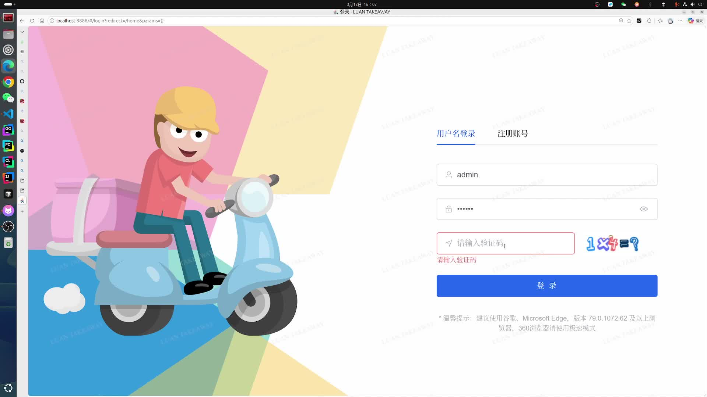

# Luan Takeaway

一个基于 Spring Boot + Spring Cloud 构建的外卖业务系统，系统按照业务领域拆分为用户、菜品、订单、支付和智能推荐等多个服务，并通过 Gateway、Nacos、Redis、RabbitMQ 等组件构建完整的服务治理与异步处理体系。

在传统外卖业务链路基础上，系统实现了独立的 **AI 点餐助手服务**（`luan-takeaway-ai`），基于 LLM 实现自然语言点餐、智能推荐与菜品知识增强。该服务基于 **LangChain4j** 构建大模型调用编排层，通过引入大模型语义理解、结构化检索、语义知识召回与融合排序机制，使系统能够同时处理明确条件查询与复杂语义推荐需求，并生成可解释的推荐结果。

项目支持一键切换微服务部署模式，开发阶段可以通过单体模式快速启动和调试，而在生产环境中可以按需拆分为多个微服务独立部署。

前端工程位于 `luan-ui`，基于 Vue3 + TypeScript + Vite 构建。

本项目的权限管理服务 `luan-upms`、认证服务 `luan-auth` 以及前端工程 `luan-ui` 基于开源项目 Pig 二次开发。原项目提供通用后台管理框架，不包含具体业务实现。本项目在此基础上设计并实现了完整的外卖业务系统，并对原有框架进行了业务适配改造。

本项目仓库地址：

* gitee: [https://gitee.com/daluan/luan-takeaway](https://gitee.com/daluan/luan-takeaway)
* github: [https://github.com/daluan2000/luan-takeaway](https://github.com/daluan2000/luan-takeaway)

## 演示视频

点击下方封面可跳转到外链视频：

[](https://www.bilibili.com/video/BV1Cww5zNEKK)


# 1 项目概述

本项目基于以下技术栈构建：

* Spring Boot
* Spring Cloud
* Nacos
* Redis
* MySQL
* RabbitMQ
* Vue3 + Typescript + Vite
* LangChain4j
* vLLM（可选，本地大模型推理）

系统整体由两类能力共同构成：

1. **传统业务服务层**：负责用户、菜品、订单、支付等核心业务执行
2. **AI 智能服务层**：负责自然语言理解、智能推荐与知识增强检索

其中 AI 服务采用独立智能编排模式运行，不直接维护业务主数据，而是通过调用业务服务与知识数据完成推荐链路：

```text id="x4n2sp"
用户自然语言输入
↓
AI Service
↓
结构化召回 + 语义相关度打分
↓
融合排序
↓
LLM 小池重排与解释
↓
返回推荐结果
```

系统支持一键切换两种运行模式：

1. **微服务模式**，多个服务独立部署：

```text
luan-gateway  网关服务
luan-auth  认证服务
luan-takeaway-ai  AI 点餐助手服务
luan-upms  用户权限管理服务
luan-takeaway-user 外卖业务用户管理服务
luan-takeaway-dish 菜品管理服务
luan-takeaway-order 订单管理服务
luan-takeaway-pay 支付管理服务
```

2. **单体模式**：

通过 `luan-boot` 聚合所有业务模块，以单进程方式运行。


# 2 系统架构

系统整体采用基于 Spring Cloud 的微服务架构，通过 Gateway 统一对外提供接口入口，并结合 Nacos 实现服务注册与配置管理。系统按照业务领域拆分为认证、权限管理、外卖业务以及智能推荐等多个微服务，各服务之间通过 Feign 进行同步调用，并通过 RabbitMQ 进行异步消息通信。

在数据层面，系统使用 MySQL 作为核心业务数据库，Redis 用于缓存与分布式锁控制，以提升高并发场景下的系统性能与稳定性。

除传统业务服务外，系统新增独立 AI Service 作为智能编排层，用于处理自然语言点餐请求与智能推荐任务。AI Service 不直接维护业务主数据，而是通过调用已有业务服务与知识数据完成混合检索推荐。

整体架构中各组件职责如下：

* Gateway：系统统一入口，负责路由转发、统一鉴权与接口限流
* Auth：认证服务，负责 Token 签发与认证校验
* Upms：权限管理服务，提供用户、角色、菜单等系统管理能力
* Takeaway Services：外卖业务服务，包括用户、菜品、订单和支付等业务模块
* Takeaway AI：智能推荐服务，负责自然语言理解、混合检索编排与推荐解释生成
* RabbitMQ：用于订单相关的异步处理与延时任务，例如库存更新、订单自动取消等
* Redis：提供缓存能力与分布式锁支持
* MySQL：存储系统核心业务数据
* Nacos：提供服务注册发现与配置管理能力

系统依赖的基础组件：

* **Nacos**：服务注册与配置中心
* **MySQL**：数据库
* **Redis**：缓存与分布式锁
* **RabbitMQ**：服务间异步通信


# 3 业务模块说明

## 3.1 平台基础能力

系统基础能力主要包括认证、权限管理及网关等通用组件：

认证服务（`luan-auth`）：提供系统统一认证能力。

权限管理服务（`luan-upms`）：提供用户、角色与菜单等系统管理能力。

网关服务（`luan-gateway`）：作为系统统一入口，负责请求路由与网关过滤。

公共组件（`luan-common`）：提供各服务共享的基础组件，例如安全组件、日志组件及 Feign 调用封装等。

## 3.2 外卖业务域

外卖业务 `luan-takeaway` 按领域划分为多个服务。

用户域（`luan-takeaway-user`）负责外卖业务用户相关能力：

* 商家管理
* 客户管理
* 骑手管理

菜品域（`luan-takeaway-dish`）负责菜品相关能力：

* 菜品维护
* 菜品上下架
* 库存管理
* 菜品知识实体管理

订单域（`luan-takeaway-order`）负责订单核心业务：

* 创建订单
* 订单状态流转
* 订单查询

支付域（`luan-takeaway-pay`）负责支付流程：

* 模拟支付
* 支付状态更新

## 3.3 AI 智能服务

AI 服务（`luan-takeaway-ai`）作为独立智能服务层，为系统提供自然语言点餐与推荐能力。

主要职责包括：

* 自然语言需求理解
* 结构化条件解析
* 语义知识检索
* 候选结果融合排序
* 推荐结果解释生成
* 菜品知识自动生成


# 4 典型业务流程

系统最小可用业务闭环如下：

1. 商家入驻、维护店铺信息
2. 商家上架菜品
3. 用户浏览并下单（传统点单，AI推荐点单）
4. 用户完成支付
5. 商家接单
6. 骑手配送
7. 订单完成

AI 点餐流程如下：

```text
用户自然语言输入
↓
Gateway
↓
AI Service
↓
Query Understanding
↓
Structured Retrieval + Semantic Scoring
↓
Fusion Ranking
↓
LLM Rerank on Top Candidates
↓
Response Generation
↓
返回推荐结果
```


# 5 微服务划分

基础中间件：

| 服务            | 说明                 |
| ------------- | ------------------ |
| luan-register | Nacos（注册中心 + 配置中心） |
| luan-mysql    | MySQL 数据库          |
| luan-redis    | Redis 缓存           |
| luan-rabbitmq | MQ异步通信             |

mysql 中包含两个数据库：

```text
luan （业务数据库）
luan_config （微服务配置数据，提供 nacos 使用）
```

核心服务：

| 服务                  | 说明              |
| ------------------- | --------------- |
| luan-gateway        | 系统网关（默认端口 9999） |
| luan-auth           | 认证中心            |
| luan-takeaway-ai    | AI 点餐助手服务       |
| luan-upms           | 系统管理服务          |
| luan-takeaway-user  | 用户服务            |
| luan-takeaway-dish  | 菜品服务            |
| luan-takeaway-order | 订单服务            |
| luan-takeaway-pay   | 支付服务            |


# 6 项目启动

项目支持 **微服务模式** 与 **单体模式** 两种启动方式。

## 6.1 微服务模式启动

**如果是 linux 系统并且已安装 docker**，系统提供了一键启动脚本：

```bash
./start-middlewares.sh
./start-java-services.sh
```

先执行 `./start-middlewares.sh`，会自动拉取官网的 mysql、redis、nacos、rabbitmq 镜像，创建容器并初始化，自动执行初始化 sql 脚本。

后执行 `./start-java-services.sh` 会自动使用 mvn 编译打包所有 java 代码，然后使用 docker 将每个微服务的 jar 包转为镜像，创建对应微服务容器并启动。

查看中间件状态：

```bash
docker compose ps luan-mysql luan-redis luan-register
```

查看微服务状态：

```bash
docker compose ps luan-gateway luan-auth luan-takeaway-ai luan-upms luan-takeaway-user luan-takeaway-dish luan-takeaway-order luan-takeaway-pay
```

停止 Java 服务：

```bash
./stop-java-services.sh
```

停止中间件：

```bash
./stop-middlewares.sh
```

如果需要图形化查看编辑 mysql 数据内容，请运行以下指令并浏览器访问 `8082` 端口：

```bash
docker compose up luan-phpmyadmin -d
```

## 6.2 单体模式启动

单体模式由 `luan-boot` 聚合运行，直接运行该项目即可，系统也提供一键运行脚本（linux）：

```bash
./start.sh
```

其实现方式是在 `luan-boot` 的 `pom.xml` 中直接聚合认证、权限和外卖各业务模块依赖，让原本拆分的 Controller、Service、Mapper 一起加载到同一个 Spring Boot 应用上下文中。

运行时通过关闭 Nacos 的服务发现与配置能力，并统一使用 `/admin` 单入口和单端口，使 Feign 顺着入口“回调自己”，把原本多服务部署的系统收敛为单 JVM 进程运行。

单体模式依然需要：

* MySQL
* Redis
* RabbitMQ

## 6.3 前端启动

进入前端工程：

```text
luan-ui
```

微服务模式：

```bash
npm run dev
```

单体模式：

```bash
npm run dev:mono
```

## 6.4 本地 vLLM 启动（可选）

如果希望 `luan-takeaway-ai` 使用本地模型，可先启动 vLLM 的 OpenAI 兼容接口。

启动：

```bash
./start-vllm.sh
```

停止：

```bash
./stop-vllm.sh
```

默认服务地址：

```text
http://127.0.0.1:8000/v1
```


# 7 业务技术实现

## 7.1 Redis 缓存优化-热点数据自适应缓存

在商户信息和菜品查询等高频读场景中，系统通过 `@SmartCache` 注解实现统一的 Redis 缓存策略。

### 核心能力

| 能力 | 实现方式 | 说明 |
|------|---------|------|
| **防穿透** | 空值缓存 | DB 不存在的数据缓存 2 分钟，避免反复打 DB |
| **防击穿** | 互斥锁 | 热点 key 过期时只允许一个线程回源，重试 3 次 |
| **防雪崩** | 随机 TTL 抖动 | 缓存过期时间 ±10% 随机偏移，避免大量 key 同时失效 |
| **热点自适应** | HotKeyManager | 60秒内访问 ≥100 次标记为热点，享受更长 TTL（30分钟 vs 5分钟） |

### 使用方式

```java
// 查询方法添加 @SmartCache 注解
@SmartCache(
    name = "dish:item",
    key = "#merchantUserId + ':' + #dishId",
    hotKeyType = HotKeyType.DISH,
    hotKeyIdExpression = "#dishId",
    baseTtlSeconds = 300,    // 普通数据 5 分钟
    hotTtlSeconds = 1800       // 热点数据 30 分钟
)
WmDish getByMerchantAndId(Long merchantUserId, Long dishId);

// 写操作方法添加 @SmartCacheEvict 注解清除缓存
@SmartCacheEvict(name = "dish:item", key = "#entity.id")
@SmartCacheEvict(name = "dish:list", allEntries = true)
boolean save(WmDish entity);
```

### 技术架构

```
@SmartCache / @SmartCacheEvict 注解
        ↓
   SmartCacheAspect（切面拦截）
        ↓
SmartCacheService（底层缓存操作）
        ↓
HotKeyTtlCalculator（热点 TTL 计算）
        ↓
HotKeyManager（热点检测）
```

### Redis Key 设计

| Key Pattern | 说明 |
|-------------|------|
| `dish:item:{merchantUserId}:{dishId}` | 单个菜品缓存 |
| `dish:list:{page}:{query}` | 菜品分页缓存 |
| `dish:knowledge:{dishId}` | 菜品知识文档缓存 |
| `merchant:current:{userId}` | 当前用户商户缓存 |
| `hot:counter:{type}:{id}` | 热点访问计数器（TTL=60秒） |
| `hot:set:{type}` | 热点 ID 集合 |

## 7.2 Redis 分布式锁（骑手抢单）

骑手抢单场景中使用 Redis 分布式锁控制并发，避免重复接单。

## 7.3 Redis库存扣减 + MQ异步落库

采用 Redis 预扣减库存 + MQ 异步更新数据库：

```text
下单请求
↓
Redis Lua脚本校验库存并扣减
↓
发送MQ消息
↓
消费者异步更新MySQL库存
```

## 7.4 RabbitMQ 异步与延时任务

用于：

* 自动取消未支付订单
* 订单状态异步通知

# 8 AI 点餐助手混合智能架构

系统采用分阶段混合检索机制，将自然语言输入逐步转换为可控推荐结果。

核心执行流程如下：

* Query Understanding：由 LLM 完成两步解析：先识别请求模式标签（`TOOL_CALLING` / `RAG`，用于意图提取与结果解释，不做二选一路由），再提取结构化意图（如类别、预算、辣度、营养区间、场景标签等）。
* Hybrid Retrieval：根据结构化意图调用菜品服务召回候选集合（`Candidate Set`）：
* * 结构化召回：先按商家、在售状态、价格上限筛选菜品。
* * 结构化过滤：结合 `DishKnowledgeDoc` 继续过滤类别、辣度、清淡/油腻、营养区间、餐段、分量等条件。（这两步理论上可以合并，但出于工程权衡，还是拆成两步）
* Fusion Ranking：对候选集合计算融合分并排序：`FusionScore = StructuredScore * 0.45 + SemanticScore * 0.35 + BusinessScore * 0.20`。
* * StructuredScore：类别/预算/辣度/清淡/餐段命中加分。
* * SemanticScore：基于意图词与知识文档词（tags、scenes、summary、embeddingText）的词项重合度打分。
* * BusinessScore：基于库存与价格带（平价优先）加分。
* LLM Selection and Generation：先取规则排序后的前置候选池（Top-N）交给 LLM 二次重排与理由改写，再返回最终推荐结果；若 LLM 失败则回退规则排序结果。

与大模型的交互基于Langchain4j实现，一种可能的示例：
```
ChatLanguageModel model = OpenAiChatModel.builder()
        .baseUrl(baseUrl)
        .apiKey(apiKey)
        .modelName(model)
        .temperature(temperature)
        .timeout(Duration.ofMillis(timeout))
        .build();

String response = model.generate(systemPrompt + "\n" + userPrompt);
```

目前实现采用本地部署vLLM，支持远程API。

## 8.1 知识建模设计

基础的菜品信息不足以提供LLM作出理解与推荐，因此为菜品构建了扩展知识库，定义为`DishKnowledgeDoc`实体。

`DishKnowledgeDoc`实体包含三层信息：结构化字段，语义字段，描述字段（任意文字描述）。结构化层里放类别、辣度、营养、餐段、分量等明确边界字段，主要在 dish 服务侧参与硬过滤；语义层里放标签、适用场景、人群这类文本特征，主要参与相关度计算。


描述层使用 `llmSummary`、`flavorDescription`、`recommendationReason` 等字段，最终用于推荐理由与展示文案生成。

关键代码位于：`WmDishServiceImpl.java`、`HybridRecommendationService.java`、`DishKnowledgeGenerationService.java`。


**知识数据自动生成与embedding**

系统支持LLM基于菜品基础信息自动生成扩展知识数据，当前采用同步调用链路：dish 服务在需要时调用 AI 接口生成 `DishKnowledgeDoc`。
关键代码位于：`WmDishServiceImpl.java`、`DishKnowledgeGenerationService.java`、`AiAssistantController.java`。

embedding text由`DishKnowledgeDoc`语义化字段拼接而成：
```
类别:{category};
标签:{tags};
场景:{suitableScenes};
人群:{suitablePeople};
口味:{flavorDescription};
```

embedding text实例：
```
类别:川菜;
标签:辣味,下饭;
场景:聚餐;
人群:重口味用户;
口味:麻辣鲜香;
```

embedding由Ollama调用云端嵌入模型，基于embedding text生成，维度固定，一种可能的示例：
```java
import dev.langchain4j.model.embedding.EmbeddingModel;
import dev.langchain4j.model.ollama.OllamaEmbeddingModel;
import dev.langchain4j.data.embedding.Embedding;

public class TestEmbedding {

    public static void main(String[] args) {

        EmbeddingModel model = OllamaEmbeddingModel.builder()
                .baseUrl("http://localhost:11434")
                .modelName("mxbai-embed-large") // 关键
                .build();

        Embedding embedding = model.embed("辣味, 下饭, 川菜").content();

        float[] vector = embedding.vector();

        System.out.println("维度: " + vector.length); // 1024
    }
}
```

生成的生成的 embedding存入redis，以提供基于相似度的向量检索。

## 8.2 查询处理流程

首先由大模型对用户自然语言进行统一语义解析：

* 结构约束意图（按照`DishKnowledgeDoc`的结构化字段，可直接映射为筛选条件）
* * 定义：能够转成明确过滤条件的“硬约束”，用于菜品候选召回与结构化过滤。
* * 对应字段：`category`、`priceMax`、`spicy`、`lightTaste`、`oily`、`vegetarian`、`caloriesMin/Max`、`proteinMin/Max`、`fatMin/Max`、`mealTime`、`portionSize` 等。
* * 示例：
* * * 用户输入：`晚饭想吃不辣的面，预算 30 以内`
* * * 解析结果：`category=面`、`spicy=false`、`priceMax=30`、`mealTime=[dinner]`

* 语义推荐意图（按照`DishKnowledgeDoc`的语义化字段，用于相似度召回）
* * 定义：不一定是硬过滤条件，但能表达偏好、场景和人群特征的“软约束”。
* * 对应字段：`keywords`、`tags`、`suitableScenes`、`avoidScenes`、`suitablePeople`、`queryRewrite` 等。
* * 示例：
* * * 用户输入：`今天有点上火，想吃清淡、好消化的`
* * * 解析结果：`tags=[清淡, 易消化]`、`avoidScenes=[上火]` 或 `suitableScenes=[胃不舒服]`


先根据语义推荐意图拼接embedding text，然后嵌入为embedding，然后在redis中做向量搜索，选取top-100/200相似度菜品，然后做根据结构约束意图做结构化筛选。

然后对筛选结果做融合排序，选择排序Top-N作为候选池，最后由 LLM 在候选池中二次重排并生成解释。


## 8.3 融合排序机制

根据结构化意图获取候选菜品后，做一轮规则融合排序。排序逻辑由三部分共同决定：
- 结构条件满足强度（预算、辣度、热量等），满足强度越高，得分越高，如对于价格，越便宜得分越高。
- 语义相关（用户意图词与知识文档词的重合程度），命中词数越高，得分越高。
- 业务可售（库存、时间等），如库存充裕得分高，

算出融合得分后按降序排列，得到 Top-N 个候选最优菜品。关键代码位于：`HybridRecommendationService.java`。

## 8.4 候选结果选取与解释

规则排序得到的 Top-N 候选并不是最终输出，系统会将该候选池交给 LLM 做二次重排，由 LLM 从中选择最多 k 个菜品并生成推荐理由（k 为前端请求的推荐数量），再返回前端。

关键代码位于：`HybridRecommendationService.java`、`OpenAiIntentRecognizer.java`。


## 8.5 当前工程实现

1. LLM 调用与配置

* 支持 `local/remote` 两种来源配置，接口为 OpenAI 兼容 `chat/completions`。
* 当前默认本地 vLLM，可切换到远程模型服务。


2. 可扩展方向

* 可将 `embeddingText` 接入向量数据库/向量索引，升级为“向量召回 + 融合重排”架构。


# 9 系统设计总结

本项目在实现外卖业务流程的基础上，重点实践了基于 Spring Cloud 的微服务架构设计。

系统通过 Gateway + Nacos + Feign 实现服务治理，通过 Redis + RabbitMQ 优化高并发链路，通过 Lua 脚本、分布式锁和异步消息机制提升稳定性。

在此基础上，系统进一步引入独立 AI Service，将自然语言理解、大模型推理与业务检索融合，形成面向真实业务场景的 Hybrid Retrieval 推荐链路，使系统同时具备结构化业务执行能力与语义智能交互能力。


